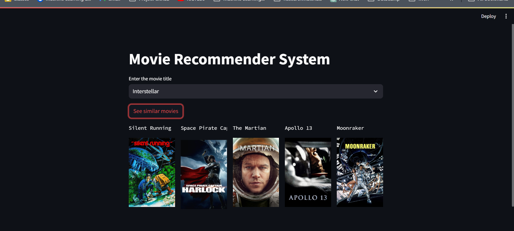

#Movie Recommender System

This is a content-based movie recommendation website, which I created using the streamlit and other python libraries. I took up this project for learning building ML based systems, following the campusx video: https://www.youtube.com/watch?v=1xtrIEwY_zY.

##Features:
1.	Search functionality to explore vast movie database with 4806 movies, where user can search their preferred movie
2.	Upto 5 movie recommendation based on the movie searched

##Tools used:
1.	Python
2.	Pandas
3.	Numpy
4.	Streamlit
5.	Pycharm
6.	Pickle

#Installation process:
1.	Clone the repository
2.	 Install the necessary dependencies using the following command on your terminal:
   a.	$ pip install -r requirements.txt
3. You need to generate the .pkl files using .ipynb file existing on the repository.
4.	Run the application locally on your system with the following command:
a.	$ streamlit run app.py
5.	Press ctrl+c to terminate the process

